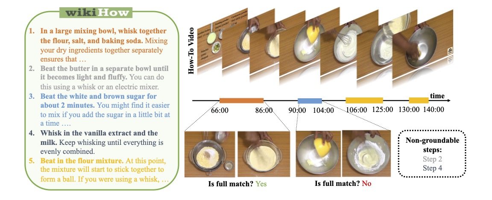

<div align="center">
  
</div>

# HT-Step: Aligning Instructional Articles with How-To Videos

Triantafyllos Afouras, Effrosyni Mavroudi, Tushar Nagarajan, Huiyu Wang, Lorenzo Torresani (NeurIPS 2023)

[[project page]](https://facebookresearch.github.io/htstep)
[[PDF]](https://openreview.net/pdf?id=vv3cocNsEK)

**HT-Step is a large-scale dataset containing temporal annotations of instructional steps in cooking videos.**  

## Annotations 
[annotations.json](data/annotations.json)

[taxonomy.json](data/taxonomy.csv)

[video_splits.json](data/video_splits.json)


## Evaluation
We provide a script for evaluating temporal article grounding under /evaluation. You can use it to evaluate models on the (seen) validation set. 
For example to compute the article grounding mAP on the provided sample predictions run:
```
python evaluation/eval_article_grounding.py --predictions_csv evaluation/example_predictions_val_seen.csv 
```

## Testing
The evaluation server is available on [Eval AI](https://eval.ai/web/challenges/challenge-page/2205/overview). 
You can use it to evaluate on the test sets (seen and unseen) as well as an unseen validation set. 
For submission instructions see [here](https://eval.ai/web/challenges/challenge-page/2205/submission).

## License
The HT-Step annotations are released under the CC-BY-NC 4.0 license. See [LICENSE](LICENSE) for additional details.
Portions of the project are available under separate license terms: The evaluation code is licensed under the [MIT license](evaluation/LICENSE).

## Citation
If this work is helpful in your research, please cite the following papers:

```bibtex
@inproceedings{Afouras_2023_htstep,
    author={Triantafyllos Afouras and Effrosyni Mavroudi and Tushar Nagarajan and Huiyu Wang and Lorenzo Torresani},
    title={{HT}-Step: Aligning Instructional Articles with How-To Videos},
    booktitle={Thirty-seventh Conference on Neural Information Processing Systems Datasets and Benchmarks Track},
    year={2023},
    url={https://openreview.net/forum?id=vv3cocNsEK}
}

@InProceedings{Mavroudi_2023_vina,
    author    = {Mavroudi, Effrosyni and Afouras, Triantafyllos and Torresani, Lorenzo},
    title     = {Learning to Ground Instructional Articles in Videos through Narrations},
    booktitle = {Proceedings of the IEEE/CVF International Conference on Computer Vision (ICCV)},
    month     = {October},
    year      = {2023},
    pages     = {15201-15213}
}
```

